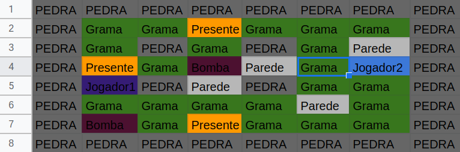

# Bomberman

## Descrição

Este projeto tem como objetivo a implementação de um jogo Bomberman utilizando a linguagem Haskell.

## Requisitos para executar o projeto no Ubuntu

* Instalar o Cabal:

```sudo apt-get install cabal-install cabal update```

* Necessário instalar a lib hspec:

```cabal install hspec```

* Rodar na pasta raiz o seguinte comando para testar:

```cabal test``` ou ```stack test```

## Tabuleiro base para teste:


